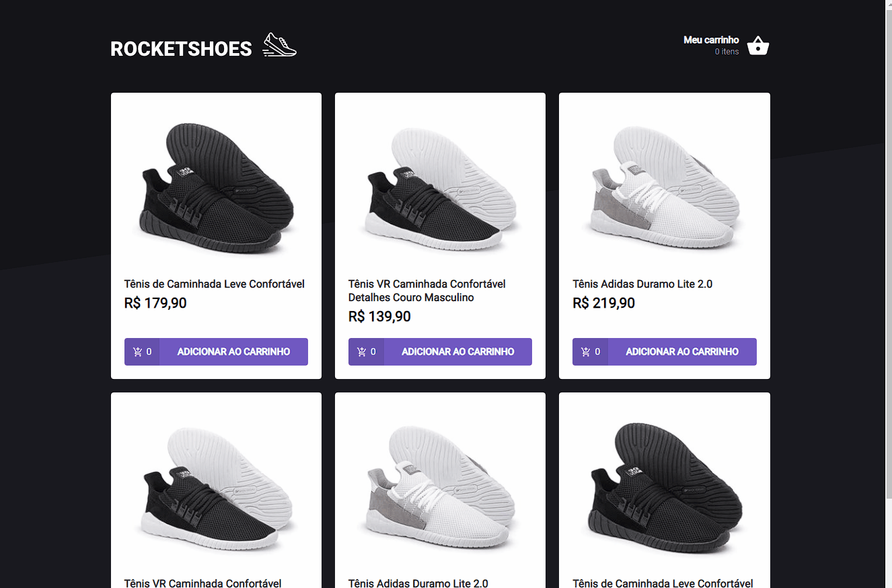
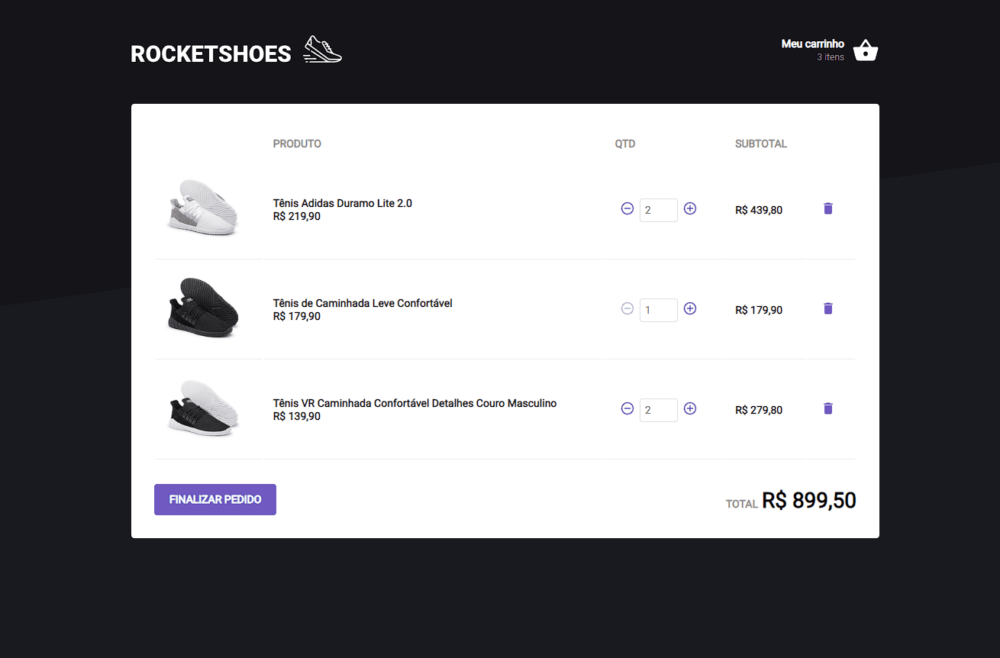

<h1 align="center">
   RocketShoes - Carrinho de compras
</h1>

 

## :camera: Demonstração

## :rocket: Tecnologias

Esse projeto foi desenvolvido com as seguintes tecnologias:

✔️Typescript

✔️React

✔️React Hooks

✔️Styled-components

✔️Axios

## 💻 Projeto

GoFinances uma aplicação financeira consumindo a API do back-end, gerenciando transações.

## ⚙ Configuração

1- Para instalar as dependências:
> yarn

2 - Iniciar a API Fake
> yarn server

3- Para iniciar a aplicação:
> yarn start

---
